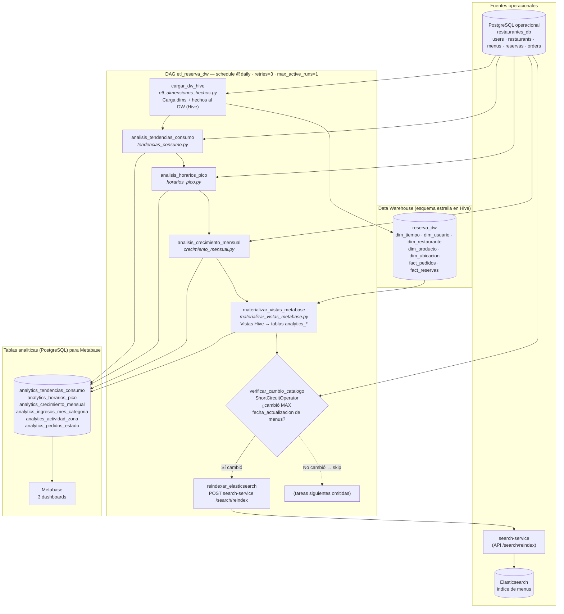
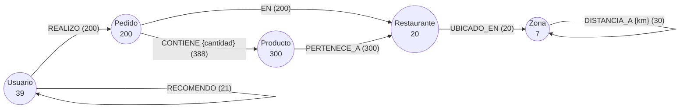
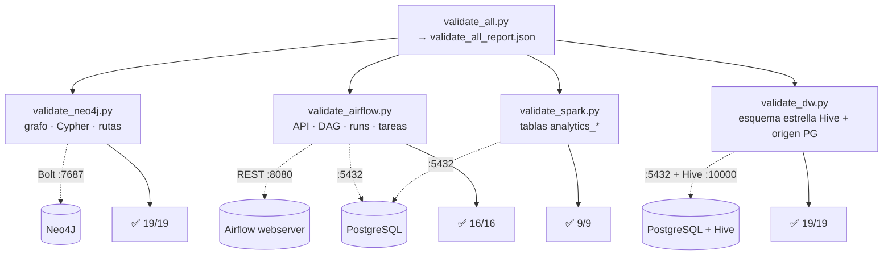

# Flujo DAG — Reserva Inteligente

Diagramas del pipeline analítico completo: el DAG de Airflow `etl_reserva_dw`,
la capa de grafos Neo4J y las validaciones automatizadas.

---

## 1. Flujo completo del DAG `etl_reserva_dw` (Airflow `@daily`)

Cadena lineal de 7 tareas. Las tareas Spark corren con `spark-submit --master local[*]`
dentro del contenedor del scheduler. La verificación de catálogo es un
`ShortCircuitOperator`: si el catálogo de menús no cambió, se salta el reindexado.

**Reglas de dependencia (idempotencia del catálogo):**
`verificar_cambio_catalogo` compara `MAX(fecha_actualizacion)` de `menus` contra el
valor guardado en una *Airflow Variable* (`ultima_fecha_actualizacion_menus`).
Solo si hay un cambio dispara `reindexar_elasticsearch`; si no, hace short-circuit
y evita reindexar Elasticsearch sin necesidad.

---

## 2. Estructura del grafo Neo4J (Req 5 y 6)

Pipeline independiente del DAG: `seed_neo4j.py` carga el grafo desde PostgreSQL.
Las consultas de co-compras, usuarios influyentes y referidos están en
`queries.cypher`; las rutas de entrega en `rutas_entrega.py`.

**Casos de uso sobre el grafo:**
- **Co-compras:** productos comprados juntos vía `(:Pedido)-[:CONTIENE]->(:Producto)`.
- **Usuarios influyentes:** actividad por `(:Usuario)-[:REALIZO]->(:Pedido)`.
- **Red de referidos:** `(:Usuario)-[:RECOMENDO]->(:Usuario)`.
- **Rutas de entrega:** `shortestPath` sobre `(:Zona)-[:DISTANCIA_A]->(:Zona)`.

---

## 3. Validaciones automatizadas (`validate_all.py`)

Orquestador que corre las 4 suites en orden y consolida el reporte.
Requiere port-forwards a neo4j (7687), airflow (8080), postgres (5432) y hive (10000).

